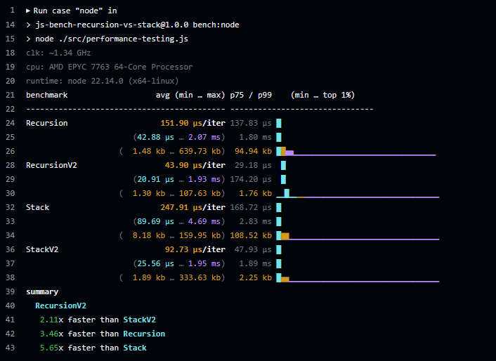
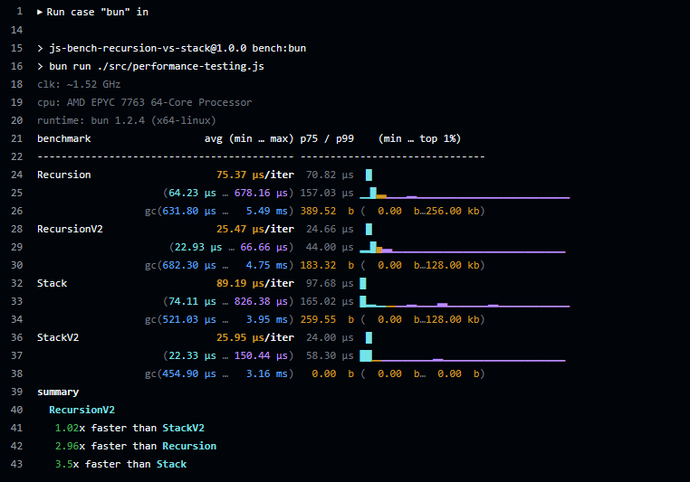
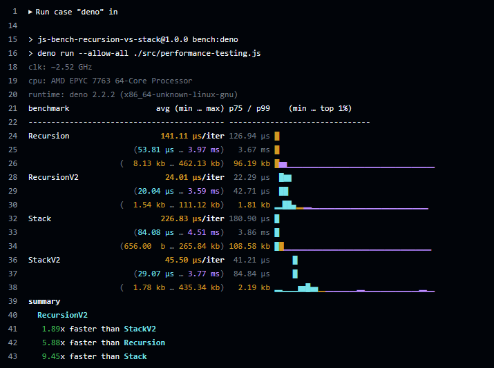

# JS Bench: Recursion vs. Stack  

A benchmarking project to compare the performance of **recursion** vs. **stack-based approaches** in JavaScript with additional comparison across **Node.js**, **Bun**, and **Deno**.

## TL;DR & Node vs Bun vs Deno
Using **recursion** is marginally faster (between 1.2x & 1.8x) and more memory efficient than the **stack-based** approach, though the difference is not always consistent and may depend on the runtime and optimizations.

### **Execution Time per Iteration (Lower is Better)**

| Runtime  | Mean Time (µs) | Median Time (µs) | Range (µs) |
|----------|--------------|---------------|-----------|
| **Deno** | **24.01**   | **22.29**     | 20.04 – 3,590 |
| **Bun**  | **25.47**   | **24.66**     | 22.93 – 66.66 |
| **Node** | **43.90**   | **29.18**     | 20.91 – 1,930 |

- **Deno is the fastest** on average (24.01 µs), with a tighter range.
- **Bun is slightly slower** (25.47 µs) but still close to Deno.
- **Node.js is significantly slower** (43.90 µs), more than **80% slower** than Deno.


### **Memory Usage (Lower is Better)**

| Runtime  | Memory Usage (Range) | Peak Memory Usage |
|----------|-------------------|----------------|
| **Deno** | 1.54 kb – 111.12 kb | **1.81 kb** |
| **Bun**  | **gc(682.30 µs … 4.75 ms)** | **183.32 b** |
| **Node** | 1.30 kb – 107.63 kb | **1.76 kb** |

- **Bun has the lowest peak memory usage (183.32 b)**, but its garbage collection (GC) can introduce some overhead.
- **Deno and Node.js use more memory (~1.76–1.81 kb peak)** but remain within similar ranges.


## What & why?

I was discussing with a friend a simple task his team had - find the values of a specific key inside a completely unknown structure of multiple nested objects & arrays [example data](./src/data/example-pipeline.json). And after some notes about using recursion or stack I wanted be completely sure which is faster and more efficient in JS.

### Should you do this kind of micro benchmarking?
No. More often than not, this is an overkill. But it was interesting to see how much faster we can make our code with small adjustments

### Code and V2 functions

Under `src/solutions` can find my "solutions" about this task, specifically
- `recursion()`
- `recursionV2()`
- `stack()`
- `stackV2()`

`recursion()` or `stack()` is the basic initial function/s I wrote, using `forEach` and not thinkng about "optimal" code. `V2` suffix indicates I went over and tweaked some small details to be "faster", like:
- simple `for` loop instead of `forEach()`
- `for ... in` instead of `Object.keys().forEach()`
- checking for array with `instanceof Array` instead of `Array.isArray`


## Benchmarks & results

You can find additional benchmarking data from my local intel & Win10 machine [here](./benchmarks/win10-intel.md)


- [GitHub action](./.github/workflows/benchmarks.yml)
- cpu: AMD EPYC 7763 64-Core Processor
- runtime: x64-linux / ubuntu

### Node v22.14.0

[Github Action logs](https://github.com/simeon-petrov-5/js-bench-recursion-vs-stack/actions/runs/13663788735/job/38200688323)

```
clk: ~1.34 GHz
cpu: AMD EPYC 7763 64-Core Processor
runtime: node 22.14.0 (x64-linux)
```

#### Execution Time
| Benchmark   | Avg (min … max) | p75 / p99 | (min … top 1%) |
|------------|----------------|------------|----------------|
| **Recursion** | 151.90 µs/iter | 137.83 µs | (42.88 µs … 2.07 ms) |
| **RecursionV2** | 43.90 µs/iter | 29.18 µs | (20.91 µs … 1.93 ms) |
| **Stack** | 247.91 µs/iter | 168.72 µs | (89.69 µs … 4.69 ms) |
| **StackV2** | 92.73 µs/iter | 47.93 µs | (25.56 µs … 1.95 ms) |

#### Memory Usage
| Benchmark   | Memory (min … max) | Top 1% Memory |
|------------|---------------------|--------------|
| **Recursion** | (1.48 kb … 639.73 kb) | 94.94 kb |
| **RecursionV2** | (1.30 kb … 107.63 kb) | 1.76 kb |
| **Stack** | (8.18 kb … 159.95 kb) | 108.52 kb |
| **StackV2** | (1.89 kb … 333.63 kb) | 2.25 kb |

#### Performance Summary
- **RecursionV2**  
  - **2.11×** faster than **StackV2**  
  - **3.46×** faster than **Recursion**  
  - **5.65×** faster than **Stack**  

<details>
  <summary>📑 Mitata logs - node</summary>


</details>

### BUN v1.2.4

[Github Action logs](https://github.com/simeon-petrov-5/js-bench-recursion-vs-stack/actions/runs/13663788735/job/38200688334)

```
clk: ~1.52 GHz
cpu: AMD EPYC 7763 64-Core Processor
runtime: bun 1.2.4 (x64-linux)
```

#### Execution Time
| Benchmark   | Avg (min … max) | p75 / p99 | (min … top 1%) |
|------------|----------------|------------|----------------|
| **Recursion** | 75.37 µs/iter | 70.82 µs | (64.23 µs … 678.16 µs) |
| **RecursionV2** | 25.47 µs/iter | 24.66 µs | (22.93 µs … 66.66 µs) |
| **Stack** | 89.19 µs/iter | 97.68 µs | (74.11 µs … 826.38 µs) |
| **StackV2** | 25.95 µs/iter | 24.00 µs | (22.33 µs … 150.44 µs) |

#### Memory Usage
| Benchmark   | Memory (min … max) | Top 1% Memory |
|------------|---------------------|--------------|
| **Recursion** | (631.80 µs … 5.49 ms) | 389.52 b |
| **RecursionV2** | (682.30 µs … 4.75 ms) | 183.32 b |
| **Stack** | (521.03 µs … 3.95 ms) | 259.55 b |
| **StackV2** | (454.90 µs … 3.16 ms) | 0.00 b |

#### Performance Summary
- **RecursionV2**  
  - **1.02×** faster than **StackV2**  
  - **2.96×** faster than **Recursion**  
  - **3.5×** faster than **Stack**  


<details>
  <summary>📑 Mitata logs - bun</summary>

  
</details>

### DENO v2.2.2

[Github Action logs](https://github.com/simeon-petrov-5/js-bench-recursion-vs-stack/actions/runs/13663788735/job/38200688330)

```
clk: ~2.52 GHz
cpu: AMD EPYC 7763 64-Core Processor
runtime: deno 2.2.2 (x86_64-unknown-linux-gnu)
```

#### Execution Time
| Benchmark   | Avg (min … max) | p75 / p99 | (min … top 1%) |
|------------|----------------|------------|----------------|
| **Recursion** | 141.11 µs/iter | 126.94 µs | (53.81 µs … 3.97 ms) |
| **RecursionV2** | 24.01 µs/iter | 22.29 µs | (20.04 µs … 3.59 ms) |
| **Stack** | 226.83 µs/iter | 180.90 µs | (84.08 µs … 4.51 ms) |
| **StackV2** | 45.50 µs/iter | 41.21 µs | (29.07 µs … 3.77 ms) |

#### Memory Usage
| Benchmark   | Memory (min … max) | Top 1% Memory |
|------------|---------------------|--------------|
| **Recursion** | (8.13 kb … 462.13 kb) | 96.19 kb |
| **RecursionV2** | (1.54 kb … 111.12 kb) | 1.81 kb |
| **Stack** | (656.00 b … 265.84 kb) | 108.58 kb |
| **StackV2** | (1.78 kb … 435.34 kb) | 2.19 kb |

#### Performance Summary
- **RecursionV2**  
  - **1.89×** faster than **StackV2**  
  - **5.88×** faster than **Recursion**  
  - **9.45×** faster than **Stack**  

<details>
  <summary>📑 Mitata logs - deno</summary>

  
</details>

## Installation
This project uses [mitata](https://github.com/evanwashere/mitata) for the benchmarks.

Clone the repository and install dependencies:  
```sh
git clone https://github.com/your-username/js-bench-recursion-vs-stack.git
cd js-bench-recursion-vs-stack
npm install
```

### Usage

Run the benchmark using different JavaScript runtimes:

- Node.js: `npm run bench:node`
- Bun: `npm run bench:bun`
- Deno: `npm run bench:deno`
- To run all benchmarks sequentially: `npm run bench:all`

### Requirements
Make sure you have the following installed (`npm install` inside the project should be all you need):
- Node.js v22.14.0
- Bun v1.2.4
- Deno v2.2.2